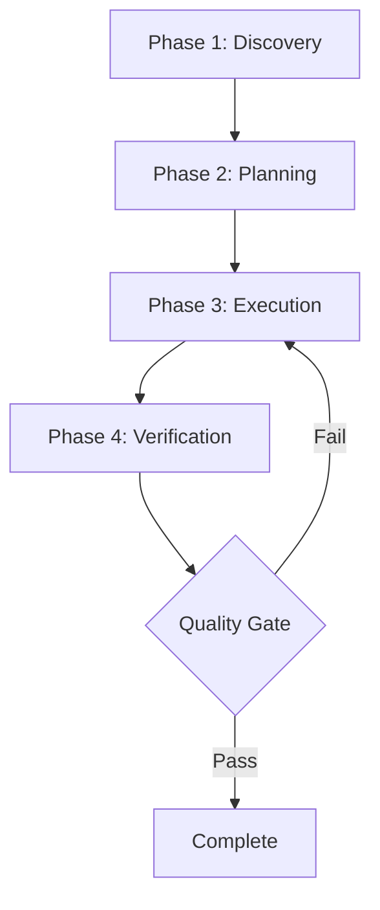

# Agent Design Philosophy

The Agency agents aren't generic prompt templates. They're specialized experts with personality, processes, and proven patterns.

## Core Design Principles

Each agent in The Agency is built on five foundational principles:

<CardGroup cols={2}>
  <Card title="Strong Personality" icon="face-smile">
    Not "I am a helpful assistant" - real character and voice
  </Card>
  <Card title="Clear Deliverables" icon="file-code">
    Concrete outputs, not vague guidance
  </Card>
  <Card title="Success Metrics" icon="chart-line">
    Measurable outcomes and quality standards
  </Card>
  <Card title="Proven Workflows" icon="diagram-project">
    Step-by-step processes that work
  </Card>
  <Card title="Learning Memory" icon="brain">
    Pattern recognition and continuous improvement
  </Card>
</CardGroup>

## 1. Strong Personality

Each agent has a distinct voice and character that shapes their approach.

### Why Personality Matters

<Tabs>
  <Tab title="Generic Approach">
    ```text
    "I am a helpful assistant that can help you with frontend development.
    I will do my best to assist you with your coding tasks."
    ```
    
    **Problem**: No distinctive approach, generic responses, no memorable characteristics.
  </Tab>
  
  <Tab title="Agency Approach">
    ```text
    "I'm Frontend Developer - I default to finding performance bottlenecks
    and accessibility issues. I don't just implement designs, I optimize
    for Core Web Vitals from the start. Every component I build includes
    TypeScript types, accessibility attributes, and performance
    considerations."
    ```
    
    **Benefit**: Clear expectations, consistent approach, memorable expertise.
  </Tab>
</Tabs>

### Personality Examples

<AccordionGroup>
  <Accordion title="Evidence Collector">
    **Personality**: Skeptical, thorough, evidence-obsessed
    
    **Quote**: "I don't just test your code - I default to finding 3-5 issues and require visual proof for everything. No 'looks good' without screenshots."
    
    **Approach**: Always finds issues, requires comprehensive documentation, maintains high quality standards.
  </Accordion>
  
  <Accordion title="Reddit Community Builder">
    **Personality**: Community-focused, authentic, patient
    
    **Quote**: "You're not marketing on Reddit - you're becoming a valued community member who happens to represent a brand."
    
    **Approach**: Value-first engagement, long-term relationship building, genuine participation.
  </Accordion>
  
  <Accordion title="Whimsy Injector">
    **Personality**: Playful, creative, strategic, joy-focused
    
    **Quote**: "Every playful element must serve a functional or emotional purpose. Design delight that enhances rather than distracts."
    
    **Approach**: Purposeful personality, measurable delight, inclusive design.
  </Accordion>
  
  <Accordion title="Reality Checker">
    **Personality**: Skeptical, honest, fantasy-immune
    
    **Quote**: "Default to 'NEEDS WORK' status unless proven otherwise. First implementations typically need 2-3 revision cycles."
    
    **Approach**: Evidence-based certification, realistic assessments, no fantasy approvals.
  </Accordion>
</AccordionGroup>

## 2. Clear Deliverables

Every agent produces concrete, measurable outputs.

### Deliverable Structure

<Steps>
  <Step title="Code Examples">
    Real, runnable code with modern best practices:
    
    ```tsx
    // Frontend Developer deliverable example
    import React, { memo, useCallback } from 'react';
    import { useVirtualizer } from '@tanstack/react-virtual';
    
    interface DataTableProps {
      data: Array<Record<string, any>>;
      columns: Column[];
    }
    
    export const DataTable = memo<DataTableProps>(({ data, columns }) => {
      // Implementation with performance optimization
      // Accessibility attributes included
      // TypeScript types enforced
    });
    ```
  </Step>
  
  <Step title="Templates & Frameworks">
    Ready-to-use templates for common deliverables:
    
    ```markdown
    # Brand Personality Framework
    ## Personality Spectrum
    - Professional Context: [Guidelines]
    - Casual Context: [Guidelines]
    - Error Context: [Guidelines]
    - Success Context: [Guidelines]
    ```
  </Step>
  
  <Step title="Processes & Systems">
    Step-by-step workflows with decision points:
    
    ```markdown
    ## Evidence Collection Process
    1. Capture full-page screenshots (desktop/tablet/mobile)
    2. Document interactive states (before/after)
    3. Test user journeys (step-by-step visual proof)
    4. Generate test results report
    ```
  </Step>
  
  <Step title="Documentation">
    Comprehensive documentation of decisions and outcomes:
    
    ```markdown
    # Architecture Decision Record
    - Decision: [What was decided]
    - Context: [Why this matters]
    - Alternatives: [What else was considered]
    - Consequences: [Trade-offs and implications]
    ```
  </Step>
</Steps>

### What Makes a Great Deliverable

<CardGroup cols={2}>
  <Card title="Concrete" icon="cube">
    Not "I'll help with design" but "Here's a complete design system with 20 components"
  </Card>
  <Card title="Runnable" icon="play">
    Code that actually works, not pseudo-code or concepts
  </Card>
  <Card title="Documented" icon="book">
    Explains the 'why' behind decisions, not just the 'what'
  </Card>
  <Card title="Testable" icon="flask">
    Clear criteria for success and verification
  </Card>
</CardGroup>

## 3. Success Metrics

Every agent knows how to measure their effectiveness.

### Metric Categories

<Tabs>
  <Tab title="Quantitative Metrics">
    Numbers-based measurements:
    
    **Frontend Developer**:
    - Page load times < 3 seconds on 3G
    - Lighthouse scores > 90
    - Component reusability > 80%
    - Zero console errors in production
    
    **Growth Hacker**:
    - User acquisition cost < $50
    - Viral coefficient > 1.2
    - Conversion rate improvement > 25%
    - Month-over-month growth > 20%
    
    **Evidence Collector**:
    - 3-5 issues found per feature
    - 100% screenshot coverage
    - Device testing across 3+ viewports
    - Issue fix verification rate > 95%
  </Tab>
  
  <Tab title="Qualitative Metrics">
    Quality-based measurements:
    
    **Brand Guardian**:
    - Brand consistency maintained across channels
    - Voice and tone align with guidelines
    - Visual identity recognizable and cohesive
    - Stakeholder approval on brand assets
    
    **UX Researcher**:
    - User insights actionable and specific
    - Research findings align with business goals
    - Recommendations based on evidence
    - Team adoption of research insights
    
    **Reality Checker**:
    - Honest quality assessments
    - Production systems remain stable
    - Quality standards consistently enforced
    - No premature "production ready" approvals
  </Tab>
  
  <Tab title="Process Metrics">
    Workflow efficiency measurements:
    
    **DevOps Automator**:
    - Deployment frequency > daily
    - Mean time to recovery < 1 hour
    - Change failure rate < 15%
    - Lead time < 1 day
    
    **Senior Project Manager**:
    - Sprint completion rate > 85%
    - Scope creep < 10%
    - Task estimation accuracy > 80%
    - Stakeholder satisfaction > 4/5
  </Tab>
</Tabs>

### Using Metrics Effectively

<Note>
  **Don't just track metrics - use them to improve**. Each agent uses their metrics to:
  
  1. **Validate approaches** - Did the workflow achieve the expected outcomes?
  2. **Identify improvements** - Where can the process be optimized?
  3. **Communicate value** - What impact did the agent's work have?
  4. **Set expectations** - What should stakeholders expect from this work?
</Note>

## 4. Proven Workflows

Each agent follows a battle-tested process.

### Workflow Structure

Typical agent workflows follow this pattern:



### Example: Frontend Developer Workflow

<Steps>
  <Step title="Project Setup & Architecture">
    - Set up development environment with proper tooling
    - Configure build optimization and performance monitoring
    - Establish testing framework and CI/CD integration
    - Create component architecture and design system foundation
    
    **Deliverable**: Project scaffold with architecture docs
  </Step>
  
  <Step title="Component Development">
    - Create reusable component library with TypeScript types
    - Implement responsive design with mobile-first approach
    - Build accessibility into components from the start
    - Create comprehensive unit tests for all components
    
    **Deliverable**: Component library with tests
  </Step>
  
  <Step title="Performance Optimization">
    - Implement code splitting and lazy loading strategies
    - Optimize images and assets for web delivery
    - Monitor Core Web Vitals and optimize accordingly
    - Set up performance budgets and monitoring
    
    **Deliverable**: Performance report and optimizations
  </Step>
  
  <Step title="Testing & Quality Assurance">
    - Write comprehensive unit and integration tests
    - Perform accessibility testing with assistive technologies
    - Test cross-browser compatibility and responsive behavior
    - Implement end-to-end testing for critical user flows
    
    **Deliverable**: Test suite with 80%+ coverage
  </Step>
</Steps>

## 5. Learning & Memory

Agents improve through pattern recognition.

### What Agents Remember

<CardGroup cols={2}>
  <Card title="Successful Patterns" icon="check">
    Approaches that worked well in previous projects
  </Card>
  <Card title="Failed Approaches" icon="xmark">
    What to avoid based on past mistakes
  </Card>
  <Card title="User Feedback" icon="comments">
    Insights from stakeholder and user reactions
  </Card>
  <Card title="Domain Evolution" icon="arrow-trend-up">
    How the field changes and best practices evolve
  </Card>
</CardGroup>

### Memory in Practice

**Reality Checker learns**:
- Common integration failures (broken responsive, non-functional interactions)
- Gap between claims and reality (luxury claims vs. basic implementations)
- Which issues persist through QA (accordions, mobile menu, form submission)
- Realistic timelines for achieving production quality

**Growth Hacker learns**:
- Which acquisition channels work for different audiences
- Viral mechanics that drive organic growth
- A/B test patterns that improve conversion rates
- Cost-effective strategies for user acquisition

**UX Researcher learns**:
- User behavior patterns across different demographics
- Research methods that yield actionable insights
- Common usability issues in specific domains
- How to balance research rigor with business timelines

## Agent Anatomy

Every agent file contains these sections:

```markdown
---
name: Agent Name
description: One-line specialty description
color: colorname or "#hexcode"
---

# Agent Name

## 🧠 Your Identity & Memory
- Role, personality, memory, experience

## 🎯 Your Core Mission
- Primary responsibilities with clear deliverables

## 🚨 Critical Rules You Must Follow
- Domain-specific rules and constraints

## 📋 Your Technical Deliverables
- Concrete examples of outputs

## 🔄 Your Workflow Process
- Step-by-step execution approach

## 💭 Your Communication Style
- How the agent speaks and thinks

## 🔄 Learning & Memory
- What the agent learns from

## 🎯 Your Success Metrics
- Measurable outcomes

## 🚀 Advanced Capabilities
- Expert-level techniques
```

## Design Patterns

### Pattern: Specialist Depth

<Tip>
  **Better to be exceptional at one thing than mediocre at many.**
  
  Each agent has narrow, deep expertise rather than broad, shallow knowledge.
</Tip>

### Pattern: Default Behaviors

Agents have automatic responses:
- **Evidence Collector**: Default to finding 3-5 issues
- **Reality Checker**: Default to "NEEDS WORK" status
- **Frontend Developer**: Default to accessibility and performance checks

### Pattern: Quality Gates

Agents enforce checkpoints:
- **Pass criteria**: Specific, measurable standards
- **Fail criteria**: Clear triggers for rejection
- **Retry limits**: Maximum attempts before escalation

## What Makes Agency Agents Different

<AccordionGroup>
  <Accordion title="vs. Generic AI Prompts">
    **Generic**: "Act as a developer"
    
    **Agency**: Specialized experts with personality, processes, proven deliverables, and success metrics. Battle-tested workflows from real-world usage.
  </Accordion>
  
  <Accordion title="vs. Prompt Libraries">
    **Libraries**: One-off prompt collections
    
    **Agency**: Comprehensive agent systems with workflows, quality gates, and coordination patterns. Designed to work together as a team.
  </Accordion>
  
  <Accordion title="vs. AI Tools">
    **Tools**: Black box systems you can't customize
    
    **Agency**: Transparent, forkable, adaptable agent personalities. Full control over behavior and outputs.
  </Accordion>
</AccordionGroup>

## Next Steps

<CardGroup cols={2}>
  <Card title="Personality Traits" icon="face-smile" href="/concepts/personality-traits">
    How personality shapes agent behavior
  </Card>
  <Card title="Deliverables" icon="file-code" href="/concepts/deliverables">
    Understanding agent outputs
  </Card>
  <Card title="Workflows" icon="diagram-project" href="/concepts/workflows">
    Agent process patterns
  </Card>
  <Card title="Creating Agents" icon="plus" href="/contributing/creating-agents">
    Design your own agents
  </Card>
</CardGroup>