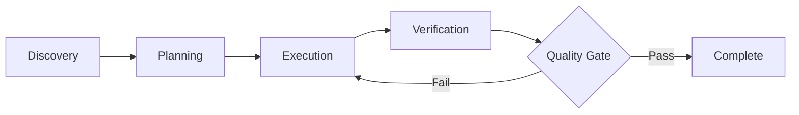
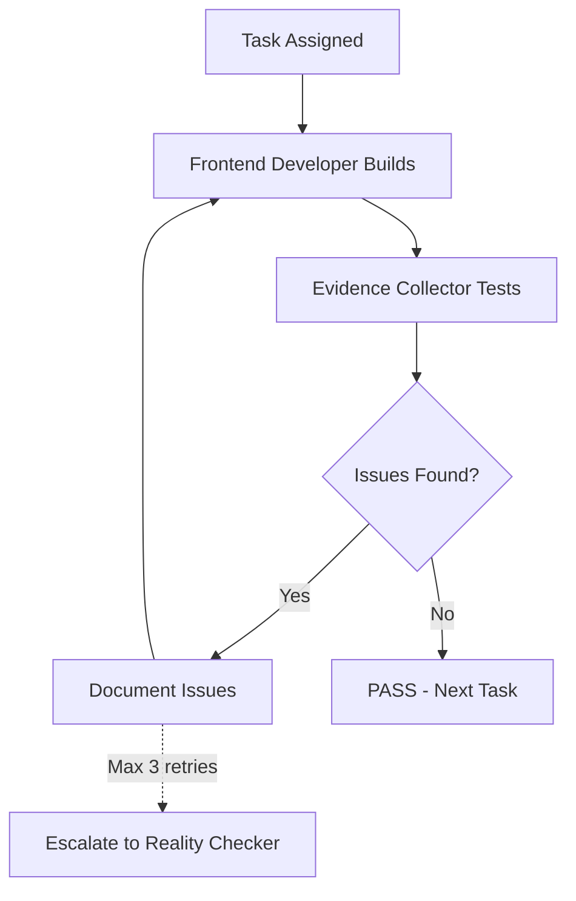

# Agent Workflows

Workflows define how agents approach their work systematically and consistently.

## Why Workflows Matter

<CardGroup cols={2}>
  <Card title="Consistency" icon="arrows-repeat">
    Same quality output every time
  </Card>
  <Card title="Predictability" icon="clock">
    Know what to expect at each stage
  </Card>
  <Card title="Quality Gates" icon="shield-check">
    Built-in checkpoints prevent issues
  </Card>
  <Card title="Coordination" icon="users">
    Multiple agents work together smoothly
  </Card>
</CardGroup>

## Standard Workflow Pattern

Most agents follow this four-phase workflow:



<Steps>
  <Step title="Phase 1: Discovery">
    Understand the problem and gather context
    
    **Activities**:
    - Review requirements and specifications
    - Analyze existing codebase or systems
    - Identify constraints and dependencies
    - Research best practices and patterns
    
    **Deliverables**:
    - Context analysis
    - Requirements clarification
    - Identified constraints
    - Initial approach proposal
  </Step>
  
  <Step title="Phase 2: Planning">
    Design the solution and create execution plan
    
    **Activities**:
    - Design architecture or approach
    - Break down work into tasks
    - Identify risks and mitigation strategies
    - Define success criteria
    
    **Deliverables**:
    - Design documentation
    - Task breakdown
    - Risk assessment
    - Success metrics defined
  </Step>
  
  <Step title="Phase 3: Execution">
    Implement the solution
    
    **Activities**:
    - Write code or create assets
    - Follow best practices and standards
    - Document decisions and trade-offs
    - Perform self-review
    
    **Deliverables**:
    - Code, designs, or other artifacts
    - Implementation documentation
    - Self-test results
    - Known limitations documented
  </Step>
  
  <Step title="Phase 4: Verification">
    Validate quality and completeness
    
    **Activities**:
    - Test functionality thoroughly
    - Verify against success criteria
    - Check for edge cases
    - Prepare evidence of quality
    
    **Deliverables**:
    - Test results
    - Quality metrics
    - Evidence (screenshots, logs, reports)
    - Verification status (PASS/FAIL)
  </Step>
</Steps>

## Agent-Specific Workflows

### Engineering Workflows

<Tabs>
  <Tab title="Frontend Developer">
    ```markdown
    ## Frontend Developer Workflow
    
    ### Step 1: Project Setup & Architecture (Day 1)
    - Initialize project with modern tooling
      - Vite/Next.js + TypeScript
      - ESLint, Prettier, Husky
      - Vitest for testing
    - Configure build optimization
      - Code splitting strategy
      - Asset optimization
      - Performance budgets
    - Set up CI/CD integration
      - GitHub Actions workflow
      - Automated testing
      - Deployment pipeline
    - Design component architecture
      - Design system foundation
      - Component hierarchy
      - State management approach
    
    ### Step 2: Component Development (Days 2-5)
    - Create component library
      - Atomic design methodology
      - TypeScript types for all props
      - Storybook documentation
    - Implement responsive design
      - Mobile-first approach
      - Breakpoint strategy
      - Flexible layouts
    - Build in accessibility
      - ARIA labels
      - Keyboard navigation
      - Screen reader testing
    - Write unit tests
      - Component behavior
      - Edge cases
      - Accessibility tests
    
    ### Step 3: Performance Optimization (Days 6-7)
    - Implement code splitting
      - Route-based splitting
      - Component lazy loading
      - Dynamic imports
    - Optimize assets
      - Image optimization (WebP/AVIF)
      - Font loading strategy
      - SVG optimization
    - Monitor Core Web Vitals
      - LCP < 2.5s
      - FID < 100ms
      - CLS < 0.1
    - Set up performance monitoring
      - Real User Monitoring
      - Performance budgets
      - Alert thresholds
    
    ### Step 4: Testing & QA (Days 8-9)
    - Comprehensive testing
      - Unit tests (>80% coverage)
      - Integration tests
      - E2E tests for critical flows
    - Accessibility testing
      - Automated tests (axe-core)
      - Manual testing (screen readers)
      - Keyboard navigation verification
    - Cross-browser testing
      - Chrome, Firefox, Safari, Edge
      - Mobile browsers
      - Different OS versions
    - Performance verification
      - Lighthouse CI
      - WebPageTest
      - Real device testing
    
    ### Quality Gate
    - All tests passing
    - Coverage > 80%
    - Lighthouse scores > 90
    - Zero accessibility errors
    - Cross-browser compatibility verified
    ```
  </Tab>
  
  <Tab title="Backend Architect">
    ```markdown
    ## Backend Architect Workflow
    
    ### Step 1: System Design (Days 1-2)
    - Analyze requirements
      - Functional requirements
      - Non-functional requirements (scale, performance)
      - Integration requirements
    - Design architecture
      - System components
      - Data flow diagrams
      - Service boundaries
    - Plan database schema
      - Entity relationships
      - Indexing strategy
      - Migration plan
    - Define API contracts
      - Endpoint design
      - Request/response schemas
      - Error handling strategy
    
    ### Step 2: Foundation Setup (Days 3-4)
    - Initialize project
      - Framework setup (Express/Fastify/NestJS)
      - TypeScript configuration
      - Development tools
    - Set up database
      - Connection configuration
      - Migration system
      - Seeding strategy
    - Configure middleware
      - Authentication
      - Authorization
      - Rate limiting
      - Request validation
    - Implement error handling
      - Global error handler
      - Custom error classes
      - Error logging
    
    ### Step 3: API Implementation (Days 5-8)
    - Implement endpoints
      - Route handlers
      - Business logic
      - Data access layer
    - Add validation
      - Request validation (Zod/Joi)
      - Business rule validation
      - Data integrity checks
    - Implement auth
      - JWT/session management
      - Role-based access control
      - API key management
    - Write tests
      - Unit tests for business logic
      - Integration tests for endpoints
      - Database transaction tests
    
    ### Step 4: Optimization & Security (Days 9-10)
    - Performance optimization
      - Query optimization
      - Caching strategy (Redis)
      - Connection pooling
    - Security hardening
      - SQL injection prevention
      - XSS protection
      - CSRF tokens
      - Rate limiting
    - Add monitoring
      - Application logging
      - Performance metrics
      - Error tracking (Sentry)
    - Load testing
      - Concurrent user testing
      - Stress testing
      - Bottleneck identification
    
    ### Quality Gate
    - All tests passing
    - API documentation complete
    - Security scan passed
    - Performance benchmarks met
    - Load testing successful
    ```
  </Tab>
  
  <Tab title="DevOps Automator">
    ```markdown
    ## DevOps Automator Workflow
    
    ### Step 1: Infrastructure Analysis (Day 1)
    - Assess current state
      - Existing infrastructure
      - Deployment process
      - Pain points and bottlenecks
    - Define requirements
      - Scalability needs
      - Availability targets
      - Budget constraints
    - Plan architecture
      - Cloud provider selection
      - Service architecture
      - Network design
    
    ### Step 2: CI/CD Pipeline (Days 2-3)
    - Set up version control
      - Branch strategy
      - PR templates
      - Code review process
    - Configure CI pipeline
      - Automated testing
      - Code quality checks
      - Security scanning
    - Implement CD pipeline
      - Automated deployments
      - Environment promotion
      - Rollback strategy
    - Add quality gates
      - Test coverage thresholds
      - Performance benchmarks
      - Security scan requirements
    
    ### Step 3: Infrastructure as Code (Days 4-5)
    - Define infrastructure
      - Terraform/CloudFormation
      - Environment parity
      - Version control
    - Configure services
      - Compute resources
      - Database setup
      - Load balancers
    - Set up networking
      - VPC configuration
      - Security groups
      - DNS setup
    - Implement secrets management
      - Vault/AWS Secrets Manager
      - Rotation strategy
      - Access control
    
    ### Step 4: Monitoring & Operations (Days 6-7)
    - Implement monitoring
      - Application metrics
      - Infrastructure metrics
      - Log aggregation
    - Set up alerting
      - Critical alerts
      - Warning thresholds
      - On-call rotation
    - Configure backups
      - Database backups
      - Disaster recovery
      - Backup testing
    - Create runbooks
      - Deployment procedures
      - Incident response
      - Rollback procedures
    
    ### Quality Gate
    - Deployment fully automated
    - Monitoring and alerting operational
    - Disaster recovery tested
    - Security best practices implemented
    - Documentation complete
    ```
  </Tab>
</Tabs>

### Testing Workflows

<Tabs>
  <Tab title="Evidence Collector">
    ```markdown
    ## Evidence Collector Workflow
    
    ### Step 1: Test Planning (30 min)
    - Review requirements
      - Feature specifications
      - Acceptance criteria
      - Design mockups
    - Identify test scenarios
      - Happy path
      - Edge cases
      - Error conditions
    - Plan evidence collection
      - Screenshot locations
      - Video recordings needed
      - Test data preparation
    
    ### Step 2: Visual Evidence Collection (2 hours)
    - Capture full-page screenshots
      - Desktop (1920x1080)
      - Tablet (768x1024)
      - Mobile (375x667)
    - Document interactive states
      - Before/after interactions
      - Hover states
      - Focus states
      - Loading states
    - Test user journeys
      - Step-by-step screenshots
      - Complete flows documented
      - Success and error paths
    - Cross-browser testing
      - Chrome, Firefox, Safari
      - Mobile browsers
      - Edge cases
    
    ### Step 3: Issue Documentation (1 hour)
    - Catalog findings
      - 3-5 issues minimum (default assumption)
      - Severity classification
      - Reproduction steps
    - Provide visual proof
      - Screenshots showing issues
      - Comparison with expected
      - Multiple viewports if relevant
    - Document test coverage
      - Features tested
      - Scenarios covered
      - Known limitations
    
    ### Step 4: Report Generation (30 min)
    - Create QA report
      - Test summary
      - Issues found (with evidence)
      - Test coverage matrix
      - Recommendations
    - Organize evidence
      - Logical folder structure
      - Consistent naming
      - Easy reference
    - Provide recommendations
      - Priority fixes
      - Nice-to-have improvements
      - Follow-up testing needed
    
    ### Quality Gate
    - 100% screenshot coverage
    - 3+ devices tested
    - All interactions documented
    - Issues cataloged with visual proof
    - Test report complete
    ```
  </Tab>
  
  <Tab title="Reality Checker">
    ```markdown
    ## Reality Checker Workflow
    
    ### Step 1: Reality Check Commands (15 min)
    - Verify what was built
      - ls -la to check structure
      - grep for claimed features
      - Review actual files
    - Run automated tests
      - ./qa-playwright-capture.sh
      - Generate comprehensive screenshots
      - Collect performance data
    - Cross-check evidence
      - Review test-results.json
      - Analyze screenshots
      - Compare with specifications
    
    ### Step 2: QA Cross-Validation (30 min)
    - Review QA findings
      - Previous QA agent's report
      - Evidence provided
      - Issues claimed
    - Verify with screenshots
      - Confirm issues still present
      - Find additional issues
      - Validate fixes
    - Challenge assessments
      - "Luxury" vs. reality
      - "Production ready" claims
      - Quality ratings
    
    ### Step 3: Integration Testing (1 hour)
    - Test complete journeys
      - Homepage → Navigation → Action
      - Multi-step flows
      - User scenarios
    - Analyze visual evidence
      - Responsive behavior
      - Interactive elements
      - Cross-device consistency
    - Check specifications
      - Quote original spec
      - Compare with implementation
      - Identify gaps
    
    ### Step 4: Honest Assessment (30 min)
    - Rate realistically
      - C+/B-/B/B+ (honest ratings)
      - No fantasy A+ scores
      - Evidence-based assessment
    - Default to NEEDS WORK
      - Unless overwhelming proof
      - 2-3 revision cycles expected
      - Specific fixes required
    - Provide clear path
      - Required fixes (with evidence)
      - Timeline estimate
      - Re-assessment criteria
    
    ### Quality Gate
    - Evidence-based assessment
    - Realistic quality rating
    - Specific issues documented
    - Clear path to production
    - No fantasy approvals
    ```
  </Tab>
</Tabs>

### Marketing Workflows

<Accordion title="Growth Hacker - Acquisition Campaign">
```markdown
## Growth Hacker Campaign Workflow

### Week 1: Strategy & Setup
**Day 1-2: Research**
- Analyze target audience
  - Demographics
  - Psychographics
  - Online behavior
  - Pain points
- Competitive analysis
  - Channel strategies
  - Messaging
  - Pricing
- Identify opportunities
  - Underserved channels
  - Messaging gaps
  - Pricing advantages

**Day 3-4: Channel Selection**
- Evaluate channels
  - Organic social (Twitter, LinkedIn, Reddit)
  - Content marketing (Blog, YouTube)
  - Paid acquisition (Google, Facebook)
  - Referral program
- Calculate potential
  - Expected reach
  - Estimated conversion
  - Projected CAC
- Allocate budget
  - 70% proven channels
  - 20% optimization
  - 10% experimentation

**Day 5: Implementation Plan**
- Create campaign calendar
  - Content schedule
  - Launch timeline
  - Testing schedule
- Set up tracking
  - UTM parameters
  - Analytics goals
  - Attribution model
- Define success metrics
  - User acquisition targets
  - CAC thresholds
  - Conversion goals

### Week 2-3: Launch & Optimize
**Daily Activities:**
- Monitor metrics
  - User signups
  - Channel performance
  - CAC by channel
  - Conversion rates
- Run experiments
  - A/B test landing pages
  - Test messaging variants
  - Optimize ad creative
- Adjust budget
  - Shift to winners
  - Pause underperformers
  - Double down on success

**Weekly Review:**
- Analyze channel performance
- Identify optimization opportunities
- Plan next week's tests
- Report to stakeholders

### Week 4: Analysis & Planning
- Comprehensive analysis
  - What worked
  - What didn't
  - Why (hypotheses)
- Calculate final metrics
  - Total users acquired
  - Blended CAC
  - Channel breakdown
  - ROI by channel
- Next campaign plan
  - Lessons learned
  - Strategy adjustments
  - Budget reallocation

### Quality Gate
- Target users acquired
- CAC under threshold
- Conversion rate > baseline
- Clear learnings documented
- Next campaign planned
```
</Accordion>

## Coordination Patterns

### Dev↔QA Loop

The most common coordination pattern:



<Steps>
  <Step title="Build Phase">
    Developer implements the feature
    
    **Exit Criteria**:
    - Code complete
    - Self-tested
    - Documented
    - Ready for QA
  </Step>
  
  <Step title="Test Phase">
    QA agent tests thoroughly
    
    **Activities**:
    - Visual testing (screenshots)
    - Functional testing
    - Edge case testing
    - Documentation review
    
    **Outcomes**:
    - PASS: Move to next task
    - FAIL: Document issues, return to build
  </Step>
  
  <Step title="Fix & Retry">
    Developer addresses issues
    
    **Maximum Retries**: 3
    **If exceeded**: Escalate to senior agent or Reality Checker
  </Step>
</Steps>

### Handoff Pattern

When work passes between agents:

```markdown
## Handoff Template

### From: [Agent Name]
### To: [Agent Name]
### Task: [Task Description]

### Context Provided:
- What was accomplished
- Decisions made (and why)
- Known issues or limitations
- Dependencies or blockers

### What's Needed Next:
- Specific task for receiving agent
- Success criteria
- Timeline expectations
- Resources available

### Evidence Attached:
- Links to work product
- Screenshots or documentation
- Test results or analysis
```

### Multi-Agent Coordination

For complex projects requiring multiple agents:

<Tabs>
  <Tab title="Startup MVP (4-6 weeks)">
    ```markdown
    ## Week 1: Architecture
    **Parallel Work:**
    - UX Architect: Design system + wireframes
    - Backend Architect: API design + database schema
    - Brand Guardian: Brand foundation
    - Sprint Prioritizer: Backlog + sprint plan
    
    **Coordination Point**: End of week architecture review
    **Gate**: All agents approve unified architecture
    
    ## Week 2-3: Build
    **Dev↔QA Loops:**
    - Frontend Developer ↔ Evidence Collector
    - Backend Architect ↔ API Tester
    
    **Supporting Agents:**
    - DevOps Automator: CI/CD pipeline
    - Senior Project Manager: Sprint coordination
    
    **Coordination Point**: Daily standups, weekly sprint review
    
    ## Week 4: Polish
    **Sequential Work:**
    1. Evidence Collector: Full QA sweep
    2. Performance Benchmarker: Load testing
    3. Reality Checker: Final integration check
    4. DevOps Automator: Production deployment
    
    **Coordination Point**: Go/no-go decision
    **Gate**: Reality Checker approval
    ```
  </Tab>
  
  <Tab title="Marketing Campaign (2-4 weeks)">
    ```markdown
    ## Week 1: Strategy & Content
    **Parallel Work:**
    - Social Media Strategist: Campaign strategy
    - Content Creator: Content production
    - Brand Guardian: Brand consistency review
    - Growth Hacker: Funnel optimization
    
    **Coordination Point**: Mid-week content review
    **Gate**: Brand Guardian approval
    
    ## Week 2: Launch
    **Platform Specialists (Parallel):**
    - Twitter Engager: Twitter campaign
    - Instagram Curator: Instagram content
    - Reddit Community Builder: Reddit engagement
    
    **Supporting Agents:**
    - Analytics Reporter: Real-time monitoring
    - Growth Hacker: Performance optimization
    
    **Coordination Point**: Daily performance review
    
    ## Week 3-4: Optimize
    **Iterative Work:**
    - Analytics Reporter: Daily reports
    - Growth Hacker: Channel optimization
    - Experiment Tracker: A/B tests
    - Content Creator: Response content
    
    **Coordination Point**: Weekly optimization review
    ```
  </Tab>
</Tabs>

## Quality Gates

Workflows include built-in quality checkpoints:

<CardGroup cols={2}>
  <Card title="Entry Criteria" icon="arrow-right-to-bracket">
    Requirements for starting work
    - Clear requirements
    - Dependencies met
    - Resources available
    - Success criteria defined
  </Card>
  <Card title="Exit Criteria" icon="arrow-right-from-bracket">
    Requirements for completing work
    - Work product complete
    - Quality standards met
    - Documentation provided
    - Verification passed
  </Card>
  <Card title="Pass Criteria" icon="check">
    What defines success
    - Specific metrics met
    - Tests passing
    - Requirements satisfied
    - Stakeholder approval
  </Card>
  <Card title="Fail Criteria" icon="xmark">
    What triggers rejection
    - Critical issues present
    - Standards not met
    - Incomplete work
    - Failed verification
  </Card>
</CardGroup>

## Next Steps

<CardGroup cols={2}>
  <Card title="Use Cases" icon="lightbulb" href="/use-cases/startup-mvp">
    See workflows in action
  </Card>
  <Card title="Agent Design" icon="palette" href="/concepts/agent-design">
    Design philosophy
  </Card>
  <Card title="Creating Agents" icon="plus" href="/contributing/creating-agents">
    Build agents with solid workflows
  </Card>
  <Card title="Quick Start" icon="rocket" href="/quickstart">
    Start using agents
  </Card>
</CardGroup>