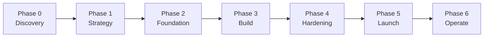

# NEXUS — Network of EXperts, Unified in Strategy

## The Agency's Complete Operational Playbook for Multi-Agent Orchestration

<Note>
NEXUS transforms The Agency's independent AI specialists into a synchronized intelligence network. This is not a prompt collection — it is a **deployment doctrine** that turns The Agency into a force multiplier for any project, product, or organization.
</Note>

## What NEXUS Solves

Individual agents are powerful. But without coordination, they produce:
- Conflicting architectural decisions
- Duplicated effort across divisions
- Quality gaps at handoff boundaries
- No shared context or institutional memory

**NEXUS eliminates these failure modes** by defining:
- **Who** activates at each phase
- **What** they produce and for whom
- **When** they hand off and to whom
- **How** quality is verified before advancement
- **Why** each agent exists in the pipeline (no passengers)

## Core Principles

<CardGroup cols={2}>
  <Card title="Pipeline Integrity" icon="shield-check">
    No phase advances without passing its quality gate
  </Card>
  <Card title="Context Continuity" icon="link">
    Every handoff carries full context — no agent starts cold
  </Card>
  <Card title="Parallel Execution" icon="layer-group">
    Independent workstreams run concurrently to compress timelines
  </Card>
  <Card title="Evidence Over Claims" icon="file-check">
    All quality assessments require proof, not assertions
  </Card>
  <Card title="Fail Fast, Fix Fast" icon="rotate">
    Maximum 3 retries per task before escalation
  </Card>
  <Card title="Single Source of Truth" icon="database">
    One canonical spec, one task list, one architecture doc
  </Card>
</CardGroup>

## The Seven-Phase Pipeline

<Steps>
  <Step title="Phase 0: Discovery">
    Intelligence gathering and validation. Understand the landscape before committing resources.
  </Step>
  <Step title="Phase 1: Strategy">
    Architecture and planning. Define what we're building and how it's structured.
  </Step>
  <Step title="Phase 2: Foundation">
    Technical scaffolding. Build the skeleton that all subsequent work depends on.
  </Step>
  <Step title="Phase 3: Build">
    Feature implementation. Dev↔QA loops for continuous quality validation.
  </Step>
  <Step title="Phase 4: Hardening">
    Quality gauntlet. Reality Checker defaults to "NEEDS WORK" until proven ready.
  </Step>
  <Step title="Phase 5: Launch">
    Go-to-market execution. Coordinated deployment across all channels.
  </Step>
  <Step title="Phase 6: Operate">
    Sustained operations. Continuous improvement and evolution.
  </Step>
</Steps>

## Deployment Modes

| Mode | Agents | Timeline | Use Case |
|------|--------|----------|----------|
| **NEXUS-Full** | All | 12-24 weeks | Complete product lifecycle |
| **NEXUS-Sprint** | 15-25 | 2-6 weeks | Feature development, MVP build |
| **NEXUS-Micro** | 5-10 | 1-5 days | Targeted task execution |

## The Agent Roster by Division

<AccordionGroup>
  <Accordion title="Engineering" icon="code">
    - Frontend Developer
    - Backend Architect
    - Mobile App Builder
    - AI Engineer
    - DevOps Automator
    - Rapid Prototyper
    - Senior Developer
  </Accordion>
  <Accordion title="Design" icon="palette">
    - UI Designer
    - UX Researcher
    - UX Architect
    - Brand Guardian
    - Visual Storyteller
    - Whimsy Injector
    - Image Prompt Engineer
  </Accordion>
  <Accordion title="Marketing" icon="megaphone">
    - Growth Hacker
    - Content Creator
    - Twitter Engager
    - TikTok Strategist
    - Instagram Curator
    - Reddit Community Builder
    - App Store Optimizer
    - Social Media Strategist
  </Accordion>
  <Accordion title="Product" icon="lightbulb">
    - Sprint Prioritizer
    - Trend Researcher
    - Feedback Synthesizer
  </Accordion>
  <Accordion title="Project Management" icon="list-check">
    - Studio Producer
    - Project Shepherd
    - Studio Operations
    - Experiment Tracker
    - Senior Project Manager
  </Accordion>
  <Accordion title="Testing" icon="vial">
    - Evidence Collector
    - Reality Checker
    - Test Results Analyzer
    - Performance Benchmarker
    - API Tester
    - Tool Evaluator
    - Workflow Optimizer
  </Accordion>
  <Accordion title="Support" icon="headset">
    - Support Responder
    - Analytics Reporter
    - Finance Tracker
    - Infrastructure Maintainer
    - Legal Compliance Checker
    - Executive Summary Generator
  </Accordion>
  <Accordion title="Spatial Computing" icon="cube">
    - XR Interface Architect
    - macOS Spatial/Metal Engineer
    - XR Immersive Developer
    - XR Cockpit Interaction Specialist
    - visionOS Spatial Engineer
    - Terminal Integration Specialist
  </Accordion>
  <Accordion title="Specialized" icon="star">
    - Agents Orchestrator
    - Data Analytics Reporter
    - LSP/Index Engineer
    - Sales Data Extraction Agent
    - Data Consolidation Agent
    - Report Distribution Agent
  </Accordion>
</AccordionGroup>

## Next Steps

<CardGroup cols={2}>
  <Card title="Quick Start" icon="bolt" href="/nexus/quickstart">
    Get from zero to orchestrated pipeline in 5 minutes
  </Card>
  <Card title="Executive Brief" icon="file-lines" href="/nexus/executive-brief">
    High-level overview and business impact
  </Card>
  <Card title="Playbooks" icon="book" href="/nexus/playbooks/phase-0-discovery">
    Detailed phase-by-phase execution guides
  </Card>
  <Card title="Runbooks" icon="rocket" href="/nexus/runbooks/startup-mvp">
    Pre-configured scenarios for common use cases
  </Card>
</CardGroup>
