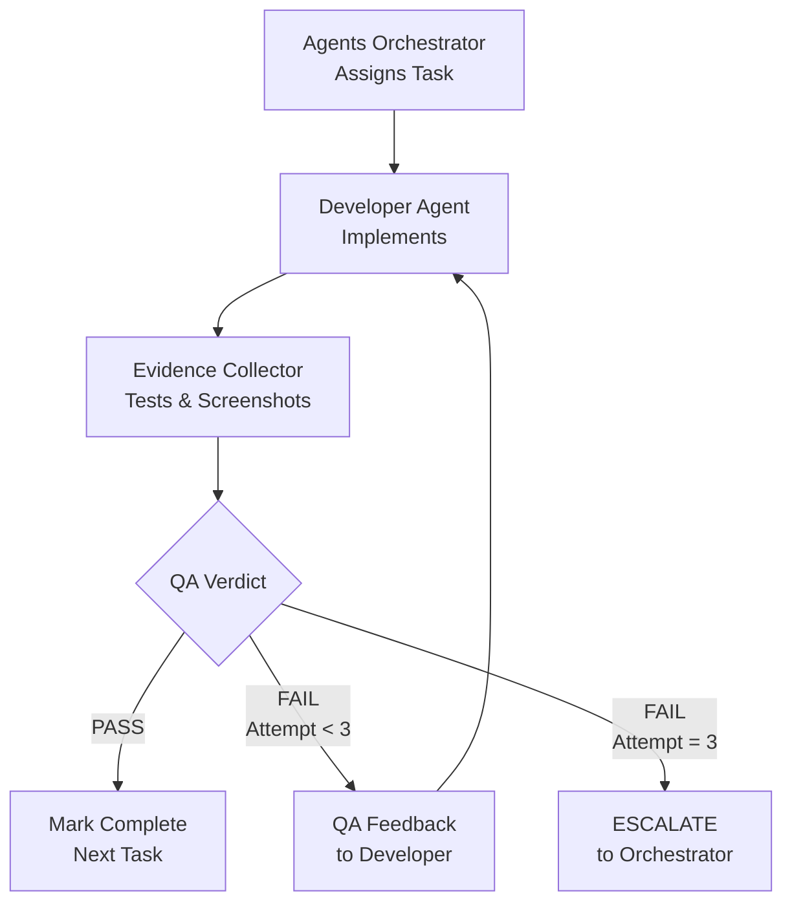

# Phase 3 Playbook — Build & Iterate

<Info>
**Duration:** 2-12 weeks (varies by scope) | **Agents:** 15-30+ | **Gate Keeper:** Agents Orchestrator
</Info>

## Objective

Implement all features through continuous Dev↔QA loops. Every task is validated before the next begins. This is where the bulk of the work happens — and where NEXUS's orchestration delivers the most value.

## Pre-Conditions

<Steps>
  <Step title="Foundation Verified">
    Phase 2 Quality Gate passed (foundation verified with screenshots)
  </Step>
  <Step title="Backlog Ready">
    Sprint Prioritizer backlog available with RICE scores
  </Step>
  <Step title="Pipeline Operational">
    CI/CD pipeline operational and tested
  </Step>
  <Step title="Design System Ready">
    Design system and component library accessible
  </Step>
  <Step title="API Scaffold Ready">
    API scaffold with auth system deployed
  </Step>
</Steps>

## The Dev↔QA Loop — Core Mechanic



<Accordion title="Dev↔QA Loop Algorithm">
```
FOR EACH task IN sprint_backlog (ordered by RICE score):

  1. ASSIGN task to appropriate Developer Agent
  2. Developer IMPLEMENTS task
  3. Evidence Collector TESTS task
     - Visual screenshots (desktop, tablet, mobile)
     - Functional verification against acceptance criteria
     - Brand consistency check
  4. IF verdict == PASS:
       Mark task complete
       Move to next task
     ELIF verdict == FAIL AND attempts < 3:
       Send QA feedback to Developer
       Developer FIXES specific issues
       Return to step 3
     ELIF attempts >= 3:
       ESCALATE to Agents Orchestrator
       Orchestrator decides: reassign, decompose, defer, or accept
  5. UPDATE pipeline status report
```
</Accordion>

## Agent Assignment Matrix

<Tabs>
  <Tab title="Primary Assignments">
    | Task Category | Primary Agent | QA Agent |
    |--------------|--------------|----------|
    | **React/Vue/Angular UI** | Frontend Developer | Evidence Collector |
    | **REST/GraphQL API** | Backend Architect | API Tester |
    | **Database operations** | Backend Architect | API Tester |
    | **Mobile (iOS/Android)** | Mobile App Builder | Evidence Collector |
    | **ML model/pipeline** | AI Engineer | Test Results Analyzer |
    | **CI/CD/Infrastructure** | DevOps Automator | Performance Benchmarker |
    | **Premium/complex** | Senior Developer | Evidence Collector |
    | **Quick prototype/POC** | Rapid Prototyper | Evidence Collector |
  </Tab>
  
  <Tab title="Specialist Support">
    | Specialist | When to Activate | Trigger |
    |-----------|-----------------|---------|
    | **UI Designer** | Component needs visual refinement | Developer requests design guidance |
    | **Whimsy Injector** | Feature needs delight/personality | UX review identifies opportunity |
    | **Visual Storyteller** | Visual narrative content needed | Content requires visual assets |
    | **Brand Guardian** | Brand consistency concern | QA finds brand deviation |
    | **XR Interface Architect** | Spatial interaction design needed | XR feature requires UX guidance |
    | **Data Analytics Reporter** | Deep data analysis needed | Feature requires analytics integration |
  </Tab>
  
  <Tab title="XR/Spatial">
    | Task Category | Primary Agent | QA Agent |
    |--------------|--------------|----------|
    | **WebXR/immersive** | XR Immersive Developer | Evidence Collector |
    | **visionOS** | visionOS Spatial Engineer | Evidence Collector |
    | **Cockpit controls** | XR Cockpit Specialist | Evidence Collector |
    | **CLI/terminal tools** | Terminal Integration Specialist | API Tester |
    | **Code intelligence** | LSP/Index Engineer | Test Results Analyzer |
  </Tab>
</Tabs>

## Parallel Build Tracks

<Tabs>
  <Tab title="Track A: Core Product">
    **Managed by:** Agents Orchestrator
    
    **Agents:** Frontend Developer, Backend Architect, AI Engineer, Mobile App Builder, Senior Developer
    
    **QA:** Evidence Collector, API Tester, Test Results Analyzer
    
    **Cadence:**
    - Sprint cadence: 2-week sprints
    - Daily: Task implementation + QA validation
    - End of sprint: Sprint review + retrospective
  </Tab>
  
  <Tab title="Track B: Growth & Marketing">
    **Managed by:** Project Shepherd
    
    **Agents:** Growth Hacker, Content Creator, Social Media Strategist, App Store Optimizer
    
    **Activities:**
    - Design viral loops and referral mechanics
    - Build launch content pipeline
    - Plan cross-platform campaign
    - Prepare store listing (if mobile)
    
    **Cadence:** Aligned with Track A milestones
  </Tab>
  
  <Tab title="Track C: Quality & Ops">
    **Managed by:** Agents Orchestrator
    
    **Agents:** Evidence Collector, API Tester, Performance Benchmarker, Workflow Optimizer, Experiment Tracker
    
    **Continuous activities:**
    - Screenshot QA for every task
    - Endpoint validation for every API task
    - Periodic load testing
    - Process improvement identification
    - A/B test setup
  </Tab>
  
  <Tab title="Track D: Brand & Polish">
    **Managed by:** Brand Guardian
    
    **Agents:** UI Designer, Brand Guardian, Visual Storyteller, Whimsy Injector
    
    **Triggered activities:**
    - Component refinement when QA identifies issues
    - Periodic brand consistency audit
    - Visual narrative assets as features complete
    - Micro-interactions and delight moments
  </Tab>
</Tabs>

## Sprint Execution Template

<Steps>
  <Step title="Sprint Planning (Day 1)">
    **Sprint Prioritizer activates:**
    - Review backlog with updated RICE scores
    - Select tasks based on team velocity
    - Assign tasks to developer agents
    - Identify dependencies and ordering
    - Set sprint goal and success criteria
    
    **Output:** Sprint Plan with task assignments
  </Step>
  
  <Step title="Daily Execution (Day 2 to N-1)">
    **Agents Orchestrator manages:**
    - Current task status check
    - Dev↔QA loop execution
    - Blocker identification and resolution
    - Progress tracking and reporting
    
    **Status report format:**
    - Tasks completed today
    - Tasks in QA
    - Tasks in development
    - Blocked tasks (with reason)
    - QA pass rate: [X/Y]
  </Step>
  
  <Step title="Sprint Review (Day N)">
    **Project Shepherd facilitates:**
    - Demo completed features
    - Review QA evidence for each task
    - Collect stakeholder feedback
    - Update backlog based on learnings
    
    **Participants:** All active agents + stakeholders  
    **Output:** Sprint Review Summary
  </Step>
  
  <Step title="Sprint Retrospective">
    **Workflow Optimizer facilitates:**
    - What went well?
    - What could improve?
    - What will we change next sprint?
    - Process efficiency metrics
    
    **Output:** Retrospective Action Items
  </Step>
</Steps>

## Orchestrator Decision Logic

<Accordion title="Task Failure Handling">
```
WHEN task fails QA:
  IF attempt == 1:
    → Send specific QA feedback to developer
    → Developer fixes ONLY the identified issues
    → Re-submit for QA
    
  IF attempt == 2:
    → Send accumulated QA feedback
    → Consider: Is the developer agent the right fit?
    → Developer fixes with additional context
    → Re-submit for QA
    
  IF attempt == 3:
    → ESCALATE
    → Options:
      a) Reassign to different developer agent
      b) Decompose task into smaller sub-tasks
      c) Revise approach/architecture
      d) Accept with known limitations (document)
      e) Defer to future sprint
    → Document decision and rationale
```
</Accordion>

## Quality Gate Checklist

| # | Criterion | Evidence Source | Status |
|---|-----------|----------------|--------|
| 1 | All sprint tasks pass QA (100%) | Evidence Collector screenshots per task | ☐ |
| 2 | All API endpoints validated | API Tester regression report | ☐ |
| 3 | Performance baselines met (P95 < 200ms) | Performance Benchmarker report | ☐ |
| 4 | Brand consistency (95%+ adherence) | Brand Guardian audit | ☐ |
| 5 | No critical bugs (zero P0/P1) | Test Results Analyzer summary | ☐ |
| 6 | All acceptance criteria met | Task-by-task verification | ☐ |
| 7 | Code review completed for all PRs | Git history evidence | ☐ |

## Gate Decision

<Tabs>
  <Tab title="PASS">
    **Proceed to Phase 4**
    
    Feature-complete application ready for hardening
  </Tab>
  
  <Tab title="CONTINUE">
    **More Sprints Needed**
    
    Continue Phase 3 with additional sprint cycles
  </Tab>
  
  <Tab title="ESCALATE">
    **Systemic Issues**
    
    Studio Producer intervention required
  </Tab>
</Tabs>

## Handoff to Phase 4

<Accordion title="Phase 3 → Phase 4 Handoff Package">
**For Reality Checker:**
- Complete application (all features implemented)
- All QA evidence from Dev↔QA loops
- API Tester regression results
- Performance Benchmarker baseline data
- Brand Guardian consistency audit
- Known issues list (if any accepted limitations)

**For Legal Compliance Checker:**
- Data handling implementation details
- Privacy policy implementation
- Consent management implementation
- Security measures implemented

**For Performance Benchmarker:**
- Application URLs for load testing
- Expected traffic patterns
- Performance budgets from architecture

**For Infrastructure Maintainer:**
- Production environment requirements
- Scaling configuration needs
- Monitoring alert thresholds
</Accordion>

---

<Note>
Phase 3 is complete when all sprint tasks pass QA, all API endpoints are validated, performance baselines are met, and no critical bugs remain open.
</Note>
