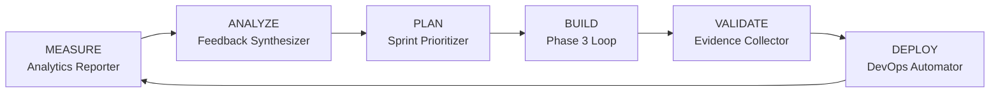

# Phase 6 Playbook — Operate & Evolve

<Info>
**Duration:** Ongoing | **Agents:** 12+ (rotating) | **Governance:** Studio Producer
</Info>

## Objective

Sustained operations with continuous improvement. The product is live — now make it thrive. This phase has no end date; it runs as long as the product is in market.

## Pre-Conditions

<Steps>
  <Step title="Stable Launch">
    Phase 5 Quality Gate passed (stable launch confirmed)
  </Step>
  <Step title="Handoff Complete">
    Phase 5 Handoff Package received
  </Step>
  <Step title="Cadences Established">
    Operational cadences established
  </Step>
  <Step title="Metrics Baselined">
    Baseline metrics documented
  </Step>
</Steps>

## Operational Cadences

### Continuous (Always Active)

| Agent | Responsibility | SLA |
|-------|---------------|-----|
| **Infrastructure Maintainer** | System uptime, performance, security | 99.9% uptime, < 30min MTTR |
| **Support Responder** | Customer support, issue resolution | < 4hr first response |
| **DevOps Automator** | Deployment pipeline, hotfixes | Multiple deploys/day capability |

### Daily

| Agent | Activity | Output |
|-------|----------|--------|
| **Analytics Reporter** | KPI dashboard update | Daily metrics snapshot |
| **Support Responder** | Issue triage and resolution | Support ticket summary |
| **Infrastructure Maintainer** | System health check | Health status report |

### Weekly

<CardGroup cols={2}>
  <Card title="Analytics Reporter" icon="chart-line">
    Weekly performance analysis
    
    **Output:** Weekly Analytics Report
  </Card>
  
  <Card title="Feedback Synthesizer" icon="comments">
    User feedback synthesis
    
    **Output:** Weekly Feedback Summary
  </Card>
  
  <Card title="Sprint Prioritizer" icon="list-check">
    Backlog grooming + sprint planning
    
    **Output:** Sprint Plan
  </Card>
  
  <Card title="Growth Hacker" icon="rocket">
    Growth channel optimization
    
    **Output:** Growth Metrics Report
  </Card>
  
  <Card title="Project Shepherd" icon="handshake">
    Cross-team coordination
    
    **Output:** Weekly Status Update
  </Card>
</CardGroup>

### Monthly

<Tabs>
  <Tab title="Executive & Finance">
    - **Executive Summary Generator** → Monthly Executive Summary
    - **Finance Tracker** → Monthly Financial Report (MRR/ARR, costs, unit economics, forecasts)
  </Tab>
  
  <Tab title="Compliance & Market">
    - **Legal Compliance Checker** → Compliance Status Report
    - **Trend Researcher** → Monthly Market Brief
    - **Brand Guardian** → Brand Health Report
  </Tab>
</Tabs>

### Quarterly

<CardGroup cols={2}>
  <Card title="Studio Producer" icon="chess">
    Strategic portfolio review
    
    **Output:** Quarterly Strategic Review
  </Card>
  
  <Card title="Workflow Optimizer" icon="arrows-spin">
    Process efficiency audit
    
    **Output:** Optimization Report
  </Card>
  
  <Card title="Performance Benchmarker" icon="gauge-high">
    Performance regression testing
    
    **Output:** Quarterly Performance Report
  </Card>
  
  <Card title="Tool Evaluator" icon="tools">
    Technology stack review
    
    **Output:** Tech Debt Assessment
  </Card>
</CardGroup>

## Continuous Improvement Loop

### Feature Development in Phase 6

<Accordion title="Compressed NEXUS Cycle for New Features">
New features follow a compressed cycle:

1. **Sprint Prioritizer** selects feature from backlog
2. **Appropriate Developer Agent** implements
3. **Evidence Collector** validates (Dev↔QA loop)
4. **DevOps Automator** deploys (feature flag or direct)
5. **Experiment Tracker** monitors (A/B test if applicable)
6. **Analytics Reporter** measures impact
7. **Feedback Synthesizer** collects user response
</Accordion>

## Incident Response Protocol

### Severity Levels

| Level | Definition | Response Time | Decision Authority |
|-------|-----------|--------------|-------------------|
| **P0 — Critical** | Service down, data loss, security breach | Immediate | Studio Producer |
| **P1 — High** | Major feature broken, significant degradation | < 1 hour | Project Shepherd |
| **P2 — Medium** | Minor feature issue, workaround available | < 4 hours | Agents Orchestrator |
| **P3 — Low** | Cosmetic issue, minor inconvenience | Next sprint | Sprint Prioritizer |

<Accordion title="Incident Response Sequence">
**DETECTION** (Infrastructure Maintainer or Support Responder)
↓
**TRIAGE** (Agents Orchestrator)
- Classify severity (P0-P3)
- Assign response team
- Notify stakeholders
↓
**RESPONSE**
- P0: Infrastructure Maintainer + DevOps + Backend Architect
- P1: Relevant Developer + DevOps
- P2: Relevant Developer
- P3: Added to sprint backlog
↓
**RESOLUTION**
- Fix implemented and deployed
- Evidence Collector verifies fix
- Infrastructure Maintainer confirms stability
↓
**POST-MORTEM** (Workflow Optimizer leads)
- Root cause analysis documented
- Prevention measures identified
- Process improvements implemented
</Accordion>

## Growth Operations

### Monthly Growth Review (Growth Hacker leads)

<Steps>
  <Step title="Channel Performance">
    - Acquisition by channel
    - CAC by channel
    - Conversion rates by funnel stage
    - LTV:CAC ratio trends
  </Step>
  
  <Step title="Experiment Results">
    - Completed A/B tests and outcomes
    - Statistical significance validation
    - Winner implementation status
    - New experiment pipeline
  </Step>
  
  <Step title="Retention Analysis">
    - Cohort retention curves
    - Churn risk identification
    - Re-engagement campaign results
    - Feature adoption metrics
  </Step>
  
  <Step title="Growth Roadmap">
    - Next month's growth experiments
    - Channel budget reallocation
    - New channel exploration
    - Viral coefficient optimization
  </Step>
</Steps>

## Strategic Evolution

### Quarterly Strategic Review (Studio Producer)

<Accordion title="Review Components">
**1. Market Position Assessment**
- Competitive landscape changes (Trend Researcher)
- Market share evolution
- Brand perception (Brand Guardian)
- Customer satisfaction (Feedback Synthesizer)

**2. Product Strategy**
- Feature roadmap review
- Technology debt (Tool Evaluator)
- Platform expansion opportunities
- Partnership evaluation

**3. Growth Strategy**
- Channel effectiveness review
- New market opportunities
- Pricing strategy assessment
- Expansion planning

**4. Organizational Health**
- Process efficiency (Workflow Optimizer)
- Team performance metrics
- Resource allocation optimization
- Capability development needs

**Output:** Quarterly Strategic Review → Updated roadmap and priorities
</Accordion>

## Phase 6 Success Metrics

<Tabs>
  <Tab title="Reliability">
    | Metric | Target | Owner |
    |--------|--------|-------|
    | System uptime | > 99.9% | Infrastructure Maintainer |
    | MTTR | < 30 minutes | Infrastructure Maintainer |
  </Tab>
  
  <Tab title="Growth">
    | Metric | Target | Owner |
    |--------|--------|-------|
    | MoM user growth | > 20% | Growth Hacker |
    | Activation rate | > 60% | Analytics Reporter |
    | Day 7 retention | > 40% | Analytics Reporter |
    | Day 30 retention | > 20% | Analytics Reporter |
  </Tab>
  
  <Tab title="Financial">
    | Metric | Target | Owner |
    |--------|--------|-------|
    | LTV:CAC ratio | > 3:1 | Finance Tracker |
    | Portfolio ROI | > 25% | Studio Producer |
  </Tab>
  
  <Tab title="Quality">
    | Metric | Target | Owner |
    |--------|--------|-------|
    | NPS score | > 50 | Feedback Synthesizer |
    | Support resolution time | < 4 hours | Support Responder |
    | Compliance adherence | > 98% | Legal Compliance Checker |
  </Tab>
  
  <Tab title="Efficiency">
    | Metric | Target | Owner |
    |--------|--------|-------|
    | Deployment frequency | Multiple/day | DevOps Automator |
    | Process improvement | 20%/quarter | Workflow Optimizer |
  </Tab>
</Tabs>

---

<Note>
Phase 6 has no end date. It runs as long as the product is in market, with continuous improvement cycles driving the product forward. The NEXUS pipeline can be re-activated (NEXUS-Sprint or NEXUS-Micro) for major new features or pivots.
</Note>
