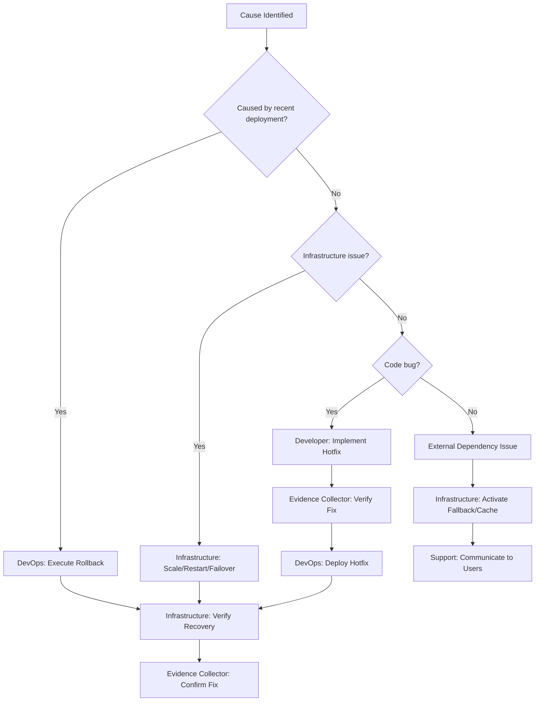

# Runbook: Incident Response

<Info>
**Mode:** NEXUS-Micro | **Duration:** Minutes to hours | **Agents:** 3-8
</Info>

## Scenario

Something is broken in production. Users are affected. Speed of response matters, but so does doing it right. This runbook covers detection through post-mortem.

## Severity Classification

| Level | Definition | Examples | Response Time |
|-------|-----------|----------|--------------|
| **P0 — Critical** | Service completely down, data loss, security breach | Database corruption, DDoS attack, auth system failure | **Immediate** (all hands) |
| **P1 — High** | Major feature broken, significant performance degradation | Payment processing down, 50%+ error rate, 10x latency | **< 1 hour** |
| **P2 — Medium** | Minor feature broken, workaround available | Search not working, non-critical API errors | **< 4 hours** |
| **P3 — Low** | Cosmetic issue, minor inconvenience | Styling bug, typo, minor UI glitch | **Next sprint** |

## Response Teams by Severity

### P0 — Critical Response Team

<CardGroup cols={2}>
  <Card title="Incident Commander" icon="user-shield">
    **Infrastructure Maintainer**
    
    Assess scope, coordinate response
  </Card>
  
  <Card title="Deployment/Rollback" icon="rotate-left">
    **DevOps Automator**
    
    Execute rollback if needed
  </Card>
  
  <Card title="Root Cause Investigation" icon="magnifying-glass">
    **Backend Architect**
    
    Diagnose system issues
  </Card>
  
  <Card title="UI Investigation" icon="window">
    **Frontend Developer**
    
    Diagnose client-side issues
  </Card>
  
  <Card title="User Communication" icon="megaphone">
    **Support Responder**
    
    Status page updates, user notifications
  </Card>
  
  <Card title="Stakeholder Comms" icon="file-lines">
    **Executive Summary Generator**
    
    Real-time executive updates
  </Card>
</CardGroup>

### P1 — High Response Team

- **Infrastructure Maintainer** (Incident commander)
- **DevOps Automator** (Deployment support)
- **Relevant Developer Agent** (Fix implementation)
- **Support Responder** (User communication)

### P2 — Medium Response

- **Relevant Developer Agent** (Fix implementation)
- **Evidence Collector** (Verify fix)

### P3 — Low Response

- **Sprint Prioritizer** (Add to backlog)

## Incident Response Sequence

### Step 1: Detection & Triage (0-5 minutes)

<Steps>
  <Step title="Trigger Received">
    Alert from monitoring / User report / Agent detection
  </Step>
  
  <Step title="Infrastructure Maintainer Actions">
    1. **Acknowledge alert**
    2. **Assess scope and impact**
       - How many users affected?
       - Which services are impacted?
       - Is data at risk?
    3. **Classify severity** (P0/P1/P2/P3)
    4. **Activate appropriate response team**
    5. **Create incident channel/thread**
  </Step>
  
  <Step title="Output">
    Incident classification + response team activated
  </Step>
</Steps>

### Step 2: Investigation (5-30 minutes)

<Tabs>
  <Tab title="Infrastructure Maintainer">
    **Parallel Investigation:**
    - Check system metrics (CPU, memory, network, disk)
    - Review error logs
    - Check recent deployments
    - Verify external dependencies
  </Tab>
  
  <Tab title="Backend Architect (P0/P1)">
    **If Backend Issue:**
    - Check database health
    - Review API error rates
    - Check service communication
    - Identify failing component
  </Tab>
  
  <Tab title="DevOps Automator">
    **Deployment Review:**
    - Review recent deployment history
    - Check CI/CD pipeline status
    - Prepare rollback if needed
    - Verify infrastructure state
  </Tab>
</Tabs>

**Output:** Root cause identified (or narrowed to component)

### Step 3: Mitigation (15-60 minutes)

<Accordion title="Decision Tree">


**Throughout Mitigation:**
- Support Responder: Update status page every 15 minutes
- Executive Summary Generator: Brief stakeholders (P0 only)
</Accordion>

### Step 4: Resolution Verification (Post-fix)

<CardGroup cols={3}>
  <Card title="Evidence Collector" icon="camera">
    1. Verify fix resolves the issue
    2. Screenshot evidence of working state
    3. Confirm no new issues introduced
  </Card>
  
  <Card title="Infrastructure Maintainer" icon="chart-line">
    1. Verify all metrics returning to normal
    2. Confirm no cascading failures
    3. Monitor for 30 minutes post-fix
  </Card>
  
  <Card title="API Tester" icon="plug">
    **If API-related:**
    1. Run regression on affected endpoints
    2. Verify response times normalized
    3. Confirm error rates at baseline
  </Card>
</CardGroup>

**Output:** Incident resolved confirmation

### Step 5: Post-Mortem (Within 48 hours)

<Accordion title="Workflow Optimizer leads post-mortem">
**1. Timeline Reconstruction**
- When was the issue introduced?
- When was it detected?
- When was it resolved?
- Total user impact duration

**2. Root Cause Analysis**
- What failed?
- Why did it fail?
- Why wasn't it caught earlier?
- 5 Whys analysis

**3. Impact Assessment**
- Users affected
- Revenue impact
- Reputation impact
- Data impact

**4. Prevention Measures**
- What monitoring would have caught this sooner?
- What testing would have prevented this?
- What process changes are needed?
- What infrastructure changes are needed?

**5. Action Items**
- [Action] → [Owner] → [Deadline]
- [Action] → [Owner] → [Deadline]
- [Action] → [Owner] → [Deadline]

**Output:** Post-Mortem Report → Sprint Prioritizer adds prevention tasks to backlog
</Accordion>

## Communication Templates

### Status Page Update (Support Responder)

<Accordion title="Status Page Template">
```
[TIMESTAMP] — [SERVICE NAME] Incident

Status: [Investigating / Identified / Monitoring / Resolved]
Impact: [Description of user impact]
Current action: [What we're doing about it]
Next update: [When to expect the next update]
```
</Accordion>

### Executive Update (Executive Summary Generator — P0 only)

<Accordion title="Executive Brief Template">
```
INCIDENT BRIEF — [TIMESTAMP]

SITUATION: [Service] is [down/degraded] affecting [N users/% of traffic]
CAUSE: [Known/Under investigation] — [Brief description if known]
ACTION: [What's being done] — ETA [time estimate]
IMPACT: [Business impact — revenue, users, reputation]
NEXT UPDATE: [Timestamp]
```
</Accordion>

## Escalation Matrix

<Warning>
**Critical Escalation Points**
</Warning>

| Condition | Escalate To | Action |
|-----------|------------|--------|
| P0 not resolved in 30 min | **Studio Producer** | Additional resources, vendor escalation |
| P1 not resolved in 2 hours | **Project Shepherd** | Resource reallocation |
| Data breach suspected | **Legal Compliance Checker** | Regulatory notification assessment |
| User data affected | **Legal Compliance + Executive Summary** | GDPR/CCPA notification |
| Revenue impact > $X | **Finance Tracker + Studio Producer** | Business impact assessment |

---

<Note>
**Speed matters, but so does documentation.** Every incident is a learning opportunity to improve the system.
</Note>
